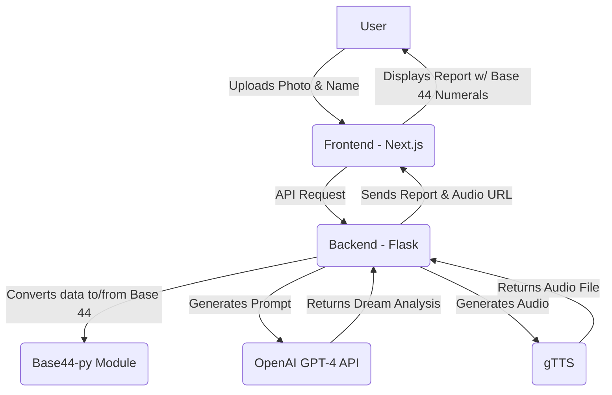

# The Celestial Bureau of Animal Consciousness 🎯

## Basic Details
### Team Name: Cypher

### Team Members
- Team Lead: Jyotsna Menon - NSS College of Engineering
- Member 2: Harikrishnan A - NSS College of Engineering

### Project Description
Welcome to **The Ministry of Absurd Inventions**, a digital hub for AI-powered pet applications. Our flagship department, **The Celestial Bureau of Consciousness**, processes, analyzes, and interprets your pet's dreams. All data is processed using our proprietary, needlessly complex **Base 44** computational framework to ensure maximum inefficiency and bureaucratic purity.

### The Problem (that doesn't exist)
For generations, pet dreams have been processed using chaotic, non-standard numeral systems (like the laughably simplistic Base 10). This anarchy in data representation makes proper, secure archiving impossible. The lack of a unified, overly complicated data standard represents a monumental failure in domestic administration. How can we trust dream data that isn't even encoded properly?

### The Solution (that nobody asked for)
Our revolutionary system converts all pet-related subconscious data into the Ministry-mandated **Base 44** format. This ensures every dream, from the simplest squirrel chase to the most profound existential nap, is encoded with purpose. By submitting a photo, our AI-powered clerks will assign a Base 44 case number (e.g., `CASE FILE #G7K-R2_9`), generate a **Dream Interpretation Report (Form 109-ZZZ)**, and provide a monotonous audio reading for your permanent records.

## Technical Details
### Technologies/Components Used
For Software:
- **Languages:**  JavaScript
- **Core Logic:** A custom **`Base44-py`** library for all numeral system conversions and calculations.
- **Frontend:** Next.js, Tailwind CSS, with custom components to render and parse Base 44 numerals.
- **Backend:** Flask. All internal logic, case file numbering, and data processing are handled exclusively in Base 44.
- **AI/ML:** OpenAI GPT-4, Pillow, gTTS.
- **Database & Storage:** PostgreSQL, Cloudinary.
- **Tools:** Git, VS Code.

### Implementation
For Software:
Home Page

Dream


# Installation
```
1. Clone the repository:
   bash
   git clone https://github.com/Kris224/The-Celestial-Bureau-of-Animal-Consciousness.git


2.  Install backend dependencies (includes our custom `Base44-py` library):
  ```bash
    cd backend
    pip install -r requirements.txt
    ```
3.  Install frontend dependencies:
    ```bash
    cd ../frontend
    npm install
    ```

# Run

1.  Start the backend server (from the `backend` directory):
    ```bash
    flask run
    ```
2.  Start the frontend development server (from the `frontend` directory):
    ```bash
    npm run dev
    ```
3.  Open your browser and navigate to `http://localhost:3000`.
```

# Screenshots (Add at least 3)
Home Page

Dream


Match


# Diagrams


# Build Photos


### Project Demo

# Video
https://youtu.be/h8zpCod3HMc

# Additional Demos
  https://app--the-celestial-bureau-of-animal-cons-99e4c2a4.base44.app/
## Team Contributions

  - **Jyotsna Menon**: Team Lead; developed the `Base44-py` core library and implemented all Base 44 backend logic in Flask; AI integration.
  - **Harikrishnan A**: Frontend Development; created the custom Next.js components to correctly display and handle Base 44 data; UI/UX and styling.

-----

Made with ❤️ and unnecessary complexity at TinkerHub Useless Projects

```
```
